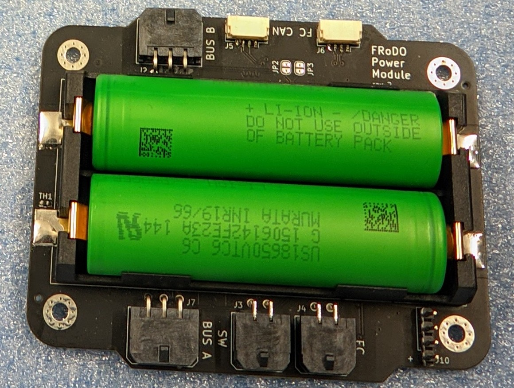

# Frodo Power Module

The battery boards for the FRoDO-rockets

## Version 1

@todo

## Version 2

The newest version of the battery developed for the FRoDO-M-rocket 

The battery module contains two lithium-ion cells in series, mounted on an *SRAD* *PCB* using a Keystone connector, allowing the replacement of battery cells. 

The battery features a linear charging IC supporting up to 700 mA of charge current and performs balancing of the cells, powered by the charge bus through a reverse current protection diode and a PTC fuse.

### Components

- 2x 3000 mA h Sony VTC6 18650 lithium-ion cells in series
- for other components see https://github.com/tudsat-rocket/frodo_power_module/blob/main/frodo_power_module.csv

### Usage

| Connector   | Purpose                                             |
| ----------- | --------------------------------------------------- |
| FC          | connect the flight computer. Outputs 8v with max ?a |
| SW          | Switch to turn the battery board on and off         |
| FC-CAN (2x) | CAN-bus for communication                           |
| BUS-A       |                                                     |
| BUS-B       |                                                     |

Spanning liegt von außen an, geht durch Arming Circuit,

## Version 3

tdb...

### ToDos for Hyacinth

- 3x 18650 lithium-ion cells in series

- New Charging IC due to more Cells

- Larger Board due to more Cells.

- Are 18650 a requirement or might they be exchanged against softbody batteries known from drones? (smaller PCB possible)

- Arming Schalter schaltet alles an.

- 

- 6 Pin durch 8 Pin ersetzen
  
  #### Possible new ICs

- https://www.ti.com/lit/ds/symlink/bq25820.pdf?ts=1739830650898&ref_url=https%253A%252F%252Fwww.ti.com%252Fbattery-management%252Fcharger-ics%252Fproducts.html

#### Ideas for Cell Voltage balancing

Good:
bq76PL536A: https://www.ti.com/lit/ds/symlink/bq76pl536a.pdf?ts=1740396899518&ref_url=https%253A%252F%252Fwww.ti.com%252Fproduct%252FBQ76PL536A - Does not require host, is availabel on lcsc: https://www.lcsc.com/search?q=BQ76PL536A&s_z=n_BQ76PL536A
BQ76922: https://www.ti.com/lit/ds/symlink/bq76922.pdf?ts=1740361016781

Okay:
BQ79606A-Q1: https://www.ti.com/lit/ds/symlink/bq79606a-q1.pdf?ts=1740391966301&ref_url=https%253A%252F%252Fwww.ti.com%252Fproduct%252FBQ79606A-Q1 - Availability is bad

Meh:
BQ76925: https://www.ti.com/lit/ds/symlink/bq76925.pdf?ts=1740385881236 - due to required host. This is just an analogue expander.